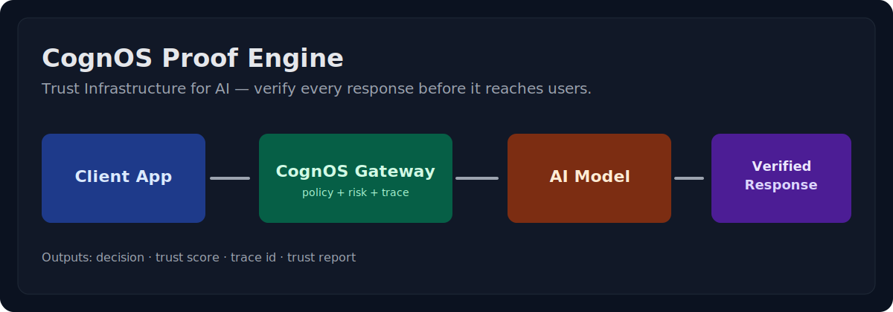
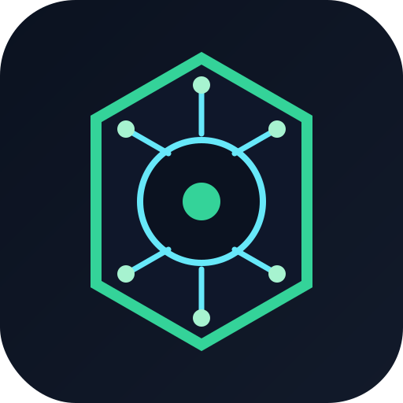

# 🔐 CognOS — Trust Verification for Every AI Decision

Verify LLM outputs. Prove correctness. Pass compliance.


**The missing trust layer for the AI economy.**

[](https://github.com/base76-research-lab/operational-cognos)
[](https://github.com/base76-research-lab/operational-cognos/actions)
[](tests/)
[](docker-compose.yml)


[](LICENSE)

## Multi-Provider Support

[](https://ai.google/)
[](https://openai.com/)
[](https://www.anthropic.com/claude)
[](https://mistral.ai/)
[](https://ollama.com/)
[](https://lovable.dev/)



## Start Here

- **Quickstart (5 min):** `docs/DEVELOPER_ONBOARDING.md`
- **Run internal PoC:** `docs/PROOF_OF_CONCEPT_INTERNAL.md`
- **Landing page:** https://base76.se/en/cognos-trust-infrastructure/
- **Works with Lovable:** https://lovable.dev/

## 🎯 Use Cases

| 🏥 Healthcare | ⚖️ Legal | 🏦 Finance | 📋 Compliance |
|---|---|---|---|
| Verify AI diagnoses before patients see them | Cryptographic proof for discovery | Risk-score every AI-assisted decision | EU AI Act + GDPR attestation |

## 30-Second Start

```bash
git clone https://github.com/base76-research-lab/operational-cognos.git
cd operational-cognos && docker-compose up
# Then: curl http://127.0.0.1:8788/healthz
```

**Or use Python SDK:**
```bash
pip install cognos-sdk
python examples/basic.py
```

**Or integrate with Claude Code (MCP):**
See [5-minute setup guide](mcp/CLAUDE_CODE_SETUP.md)

## External Quickstart (3 Steps)

Use this when someone wants to test “proofing your concept/company” fast.

1. Clone

```bash
git clone https://github.com/base76-research-lab/operational-cognos.git
cd operational-cognos
```

2. Install

```bash
python3 -m venv .venv
. .venv/bin/activate
pip install -r requirements.txt
```

3. Start + run first proof request

```bash
export COGNOS_UPSTREAM_BASE_URL="https://openrouter.ai/api/v1"
export COGNOS_UPSTREAM_API_KEY="YOUR_PROVIDER_KEY"
export COGNOS_MOCK_UPSTREAM=false

python3 -m uvicorn --app-dir src main:app --host 127.0.0.1 --port 8788
```

In another terminal:

```bash
curl -sS http://127.0.0.1:8788/v1/chat/completions \
   -H 'Content-Type: application/json' \
   -d '{
      "model": "openai:gpt-4o-mini",
      "messages": [{"role":"user","content":"Proofread and stress-test my concept pitch in 5 bullets."}],
      "cognos": {"mode":"monitor"}
   }'
```

Switch model prefix as needed:

- `openai:gpt-4o-mini`
- `google:gemini-2.0-flash-001`
- `claude:claude-sonnet-4`
- `mistral:mistral-small-latest`
- `ollama:llama3.2`

## API Contract (Source of Truth)

- Canonical OpenAPI MVP:
   - `docs/spec/cognos_openapi_mvp.yaml`
- Engine parity checklist:
   - `docs/ENGINE_PARITY.md`

Contract-first policy:
- Any API behavior change must update both OpenAPI and contract smoke tests.

## What This Repo Contains

Only the operational engine components built and run by agents:

- Gateway runtime
- Agent orchestration
- Social content generation and publishing pipeline
- End-to-end autopilot (generate → cleanup → git → push)

## Gateway Runtime

1. Install dependencies: `pip install -r requirements.txt`
2. Set environment variables (copy `.env.example`) and choose upstream mode:
   - Option A (OpenAI API key):
      - `export COGNOS_UPSTREAM_BASE_URL="https://api.openai.com/v1"`
      - `export COGNOS_UPSTREAM_API_KEY="sk-..."`
      - `export COGNOS_ALLOW_NO_UPSTREAM_AUTH=false`
   - Option B (Local Ollama):
      - `export COGNOS_UPSTREAM_BASE_URL="http://127.0.0.1:11434/v1"`
      - `export COGNOS_UPSTREAM_API_KEY=""`
      - `export COGNOS_ALLOW_NO_UPSTREAM_AUTH=true`
   - In both cases:
      - `export COGNOS_MOCK_UPSTREAM=false`
   - Optional provider instances (no key required yet, scaffold only):
      - `export COGNOS_INSTANCE_OPENAI_BASE_URL="https://api.openai.com/v1"`
      - `export COGNOS_INSTANCE_GOOGLE_BASE_URL="https://openrouter.ai/api/v1"`
      - `export COGNOS_INSTANCE_CLAUDE_BASE_URL="https://openrouter.ai/api/v1"`
      - `export COGNOS_INSTANCE_MISTRAL_BASE_URL="https://openrouter.ai/api/v1"`
      - `export COGNOS_INSTANCE_OLLAMA_BASE_URL="https://api.ollama.com/v1"`
      - add keys later with:
         - `COGNOS_INSTANCE_OPENAI_API_KEY`
         - `COGNOS_INSTANCE_GOOGLE_API_KEY`
         - `COGNOS_INSTANCE_CLAUDE_API_KEY`
         - `COGNOS_INSTANCE_MISTRAL_API_KEY`
         - `COGNOS_INSTANCE_OLLAMA_API_KEY`
3. Start server: `python3 -m uvicorn --app-dir src main:app --reload --port 8788`
4. Health check: `GET http://127.0.0.1:8788/healthz`

Ubuntu/PEP668 note:

- If `pip` is locked in the system environment, run: `python3 -m pip install --user --break-system-packages -r requirements.txt`

### Local Ollama as Upstream

Use this when OpenAI quota is exhausted and you want local inference.

- Start Ollama locally (default endpoint `http://127.0.0.1:11434`)
- Set env:
   - `export COGNOS_UPSTREAM_BASE_URL="http://127.0.0.1:11434/v1"`
   - `export COGNOS_UPSTREAM_API_KEY=""`
   - `export COGNOS_ALLOW_NO_UPSTREAM_AUTH=true`
   - `export COGNOS_MOCK_UPSTREAM=false`
- Use an Ollama model id in requests, e.g. `llama3.2:latest`

### Ollama Cloud as Provider Instance

Use this when you want Ollama-hosted cloud models via provider prefix routing.

```bash
export COGNOS_INSTANCE_OLLAMA_BASE_URL="https://api.ollama.com/v1"
export COGNOS_INSTANCE_OLLAMA_API_KEY="YOUR_OLLAMA_CLOUD_KEY"
```

Then call with an Ollama-prefixed model:

```bash
curl -sS http://127.0.0.1:8788/v1/chat/completions \
   -H 'Content-Type: application/json' \
   -d '{
      "model": "ollama:llama3.2",
      "messages": [{"role":"user","content":"Explain trust verification in 3 bullets."}],
      "cognos": {"mode":"monitor"}
   }'
```

### Prefix-based Provider Routing

Gateway can route by model prefix without changing endpoint:

- `openai:gpt-4o-mini`
- `google:gemini-2.0-flash-001`
- `claude:claude-sonnet-4`
- `mistral:mistral-small-latest`
- `ollama:llama3.2`

Behavior:

- If instance env vars are set, prefix chooses that instance base URL/key.
- If no instance key exists yet, request can still run only if your active upstream allows authless mode (e.g. local Ollama with `COGNOS_ALLOW_NO_UPSTREAM_AUTH=true`).
- For OpenRouter-style upstreams, prefixed models are normalized automatically.

## ⚖️ Why CognOS?

| Feature | CognOS | Guardrails | Homegrown |
|---------|--------|------------|-----------|
| **Verify outputs** | ✅ Built-in | ❌ Content filter only | ❌ Manual |
| **Audit trails** | ✅ Cryptographic | ❌ None | ⚠️ Logging only |
| **Multi-provider** | ✅ 5 providers | ❌ Claude-only | ⚠️ Single provider |
| **Risk scoring** | ✅ Epistemic + Aleatoric UQ | ❌ None | ❌ None |
| **Drop-in setup** | ✅ 30 seconds | ⚠️ Code changes | ❌ 1+ weeks |
| **Compliance ready** | ✅ EU AI Act, GDPR, SOC2 | ❌ Not covered | ❌ DIY |
| **Open source** | ✅ MIT | ✅ MIT | ⚠️ Proprietary |

## 💬 What People Are Saying

> "Finally, a way to prove our AI decisions are safe to regulators."
> — Healthcare Compliance Officer

> "Cut our trust audit time from 2 months to 2 weeks."
> — Fintech Risk Lead

> "This is the infrastructure layer we've all been waiting for."
> — AI Safety Researcher

## Smoke + Validation

- Enable local mock upstream: `export COGNOS_MOCK_UPSTREAM=true`
- Run OC-001 smoke test (100 requests): `python3 src/smoke_oc001.py`
- Run OC-002 smoke test (trace persist + endpoint): `python3 src/smoke_oc002.py`
- Run OC-006 smoke test (TVV sync from trace-db): `python3 src/smoke_oc006.py`

## Trace Persistence

- DB path is controlled by `COGNOS_TRACE_DB` (default: `data/traces.sqlite3`)
- Get trace: `GET /v1/traces/{trace_id}`

## Agent Orchestration

1. Check status: `python3 src/agent_orchestrator.py status`
2. Fetch next task: `python3 src/agent_orchestrator.py next`
3. Filter by agent: `python3 src/agent_orchestrator.py next --agent builder`
4. Mark start/complete:
   - `python3 src/agent_orchestrator.py start --id OC-001`
   - `python3 src/agent_orchestrator.py complete --id OC-001 --notes "done"`
5. Update metrics:
   - `python3 src/agent_orchestrator.py metrics --tvv-requests 100 --tvv-tokens 30000 --external-integrations 1 --enforce-share 0.1`
6. Sync TVV automatically from trace-db:
   - `python3 src/agent_orchestrator.py sync-tvv`

Detailed runbook: `docs/AGENT_EXECUTION.md`

## GitHub Autopilot

- Create repo + commit + push automatically:
   - `python3 src/gh_autopilot.py --repo operational-cognos --owner base76-research-lab --visibility private`
- Guide: `docs/GITHUB_AUTOPILOT.md`

## n8n Social Autopilot

Status: autopost is paused (PIN). Active mode is manual publishing.

This flow is the distribution layer in **CognOS Proof Engine**.

- Generate content from agent data:
   - `python3 src/social_content_pipeline.py --stdout`
- Publishing workflow:
   - `ops/n8n/workflows/cognos-social-autopilot.json`
- LinkedIn: use n8n OAuth credential connected to profile (`/in/bjornshomelab`) as primary path
- Profile URLs (for metadata/templates):
   - `LINKEDIN_PROFILE_URL`, `X_PROFILE_URL` in `.env`
- Publishing gate:
   - `LINKEDIN_AUTOPUBLISH=true` and/or `X_AUTOPUBLISH=true` required for live posting
- Guide:
   - `docs/N8N_SOCIAL_AUTOMATION.md`
- Agent capture (all generated payloads):
   - `ops/content/agent_posts/`

## Manual Post Generator

- Generate copy for LinkedIn + X to markdown file:
   - `python3 src/manual_post_generator.py`
- LinkedIn only:
   - `python3 src/manual_post_generator.py --channel linkedin`
- Print to terminal instead of file:
   - `python3 src/manual_post_generator.py --stdout`
- Output directory:
   - `ops/content/manual_posts/`
- Cleanup capture files (keep latest 100):
   - `python3 src/cleanup_agent_posts.py --keep 100 --dry-run`
   - `python3 src/cleanup_agent_posts.py --keep 100`

## CognOS Proof Engine Autopilot (handsfree)

- Run full chain automatically (generate + cleanup + commit + push):
   - `python3 src/proof_engine_autopilot.py`
- Generation only (no git):
   - `python3 src/proof_engine_autopilot.py --no-git`
- Commit without push:
   - `python3 src/proof_engine_autopilot.py --no-push`

## Manual Research Mode (No Agents)

- Generate a manual research brief + execution plan:
   - `python3 src/research_execution_plan.py`
- Print plan to terminal:
   - `python3 src/research_execution_plan.py --stdout`
- Include more prioritized items:
   - `python3 src/research_execution_plan.py --top 5`
- Guide:
   - `docs/RESEARCH_EXECUTION_MODE.md`

## Externalization Sprint (14 Days)

Current bottleneck is external traffic, not internal capability.

- Sprint plan:
   - `docs/EXTERNALIZATION_SPRINT_14D.md`

## Multi-Framework Integration Pack

- Anthropic tool schema/wrapper, MCP-compatible bridge, LangChain, AutoGen, and CrewAI wrappers:
   - `ops/integrations/README.md`

## CognOS CLI (pip install)

Install locally:

- `pip install -e .`

Set runtime environment:

- `export COGNOS_BASE_URL="http://127.0.0.1:8788"`
- `export COGNOS_API_KEY=""`
- `export COGNOS_UPSTREAM_AUTH="Bearer YOUR_UPSTREAM_KEY"`

Run:

- `cognos chat "Explain GDPR lawful basis in 3 bullets" --mode monitor`
- `cognos trace tr_xxxxxxxxxxxx`
- `cognos report --trace-ids tr_xxx tr_yyy --regime EU_AI_ACT`

## Example Projects

- Python OpenAI-compatible example:
   - `examples/python_openai_compatible.py`
- CLI quickstart script:
   - `examples/cli_quickstart.sh`
- HTTP/curl examples:
   - `examples/http_curl_examples.md`

## Developer Onboarding

- External onboarding guide:
   - `docs/DEVELOPER_ONBOARDING.md`
- Internal PoC flow:
   - `docs/PROOF_OF_CONCEPT_INTERNAL.md`
- Public proof snapshot:
   - `docs/PROOF_SNAPSHOT_2026-02-27.md`
- Vibecoding planning mode (Lovable):
   - `docs/VIBECODING_PLANNING_MODE.md`

## Public Endpoint Deployment

- Minimal deploy + security runbook (Fly.io / Railway):
   - `docs/PUBLIC_DEPLOY_RUNBOOK.md`
- Live launch copy/paste checklist:
   - `docs/LIVE_LAUNCH_CHECKLIST.md`
- Included deploy files:
   - `fly.toml` (Fly.io)
   - `Procfile` (Railway/Procfile platforms)

## Agent-Builder Outreach

- Ready-to-use outreach copy:
   - `docs/OUTREACH_AGENT_BUILDERS.md`

## 🗺️ Roadmap

- [x] Core trust verification engine
- [x] Multi-provider gateway (OpenAI, Claude, Google, Mistral, Ollama)
- [x] Python SDK + MCP Server for Claude Code
- [x] Docker support + docker-compose
- [x] Full test suite (68 tests, 100% critical paths)
- [ ] **Q2 2026:** Certification programs (SOC2 Type I)
- [ ] **Q2 2026:** Policy template library (EU AI Act, GDPR, HIPAA)
- [ ] **Q3 2026:** Model registry + compatibility matrix
- [ ] **Q3 2026:** Enterprise support + sales partnerships

## 🤝 Join the Community

We're looking for:

**🔬 Researchers**
- Epistemology & formal verification
- AI safety & uncertainty quantification
- Policy & governance

**👨‍💻 Builders**
- Integration with LangChain, AutoGen, CrewAI
- Frontend dashboard for trace visualization
- Additional LLM provider support

**🏢 Enterprise**
- Sales, partnerships, customer success
- Early pilots (healthcare, fintech, legal)

[Contribute](CONTRIBUTING.md) · [Discussions](https://github.com/base76-research-lab/operational-cognos/discussions) · [Discord](https://discord.gg/base76)

---



**CognOS — Trust Infrastructure for AI**
